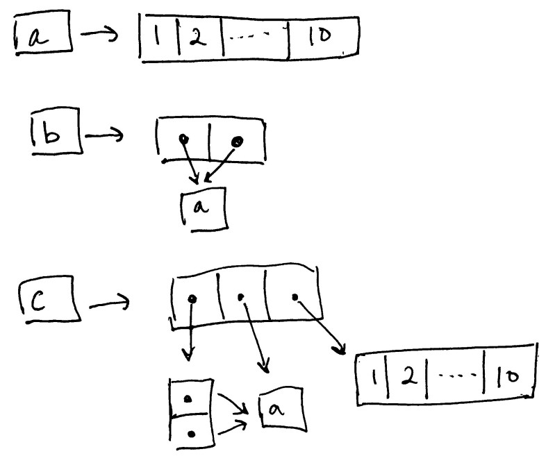

```r
library(lobstr)
```

# Quiz

I redid the quiz questions after working through the chapter.

1. Given the following data frame, how do I create a new column called "3" that
contains the sum of `1` and `2`? What makes `1`, `2`, and `3` challenging as
variable names?


```r
df <- data.frame(runif(3), runif(3))
names(df) <- c(1, 2)

df$`3` <- rep(0, 3)
df
```

```
##            1         2 3
## 1 0.47394500 0.6930308 0
## 2 0.06131685 0.8802249 0
## 3 0.56927788 0.8277502 0
```

`1`, `2`, and `3` are non-syntactic names since the variable names starts with
digits.


2. In the following code, how much memory does `y` occupy?


```r
x <- runif(1e6)
y <- list(x, x, x)

obj_size(y)
```

```
## 8.00 MB
```

`y` occupies 8 MB of memory.


3. On which line does `a` get copied in the following example?


```r
a <- c(1, 5, 3, 2)
b <- a
b[[1]] <- 10
```

The object `a` gets copied on line 3.

Code to check:

```r
a <- c(1, 5, 3, 2)
tracemem(a)
```

```
## [1] "<000001ABD1648A88>"
```

```r
b <- a 
b[[1]] <- 10 # tracemem output here
```

```
## tracemem[0x000001abd1648a88 -> 0x000001abd163eda8]: eval eval eval_with_user_handlers withVisible withCallingHandlers handle timing_fn evaluate_call <Anonymous> evaluate in_dir in_input_dir eng_r block_exec call_block process_group.block process_group withCallingHandlers process_file <Anonymous> <Anonymous>
```

```r
untracemem(x)
```


# 2.2 Binding basics


```r
# tl;dr: variable names are pointers (memory addresses, book calls them bindings)
#     if you refer to the same object in memory, you should expect to get the same pointer

x <- c(1, 2, 3)
y <- x

obj_addr(x)
```

```
## [1] "0x1abd162cd68"
```

```r
obj_addr(y)
```

```
## [1] "0x1abd162cd68"
```

```r
# same address
```

## 2.2.1 Non-syntactic names

* syntactic names:

  - contains ASCII chars, digits, `.`, and `_`
  
  - cannot begin with `.` and `_` or any reserved words
  
* naming rules can be overriden with backticks


## 2.2.2 Exercises

1. Explain the relationship between `a`, `b`, `c`, and `d` in the following code:


```r
a <- 1:10
b <- a
c <- b
d <- 1:10
```

`a`, `b`, and `c` point to the same object in memory. `d` is its own distinct object.


```r
obj_addrs(list(a, b, c, d))
```

```
## [1] "0x1abd010ae90" "0x1abd010ae90" "0x1abd010ae90" "0x1abd05f4d28"
```

2. The following code accesses the mean function in multiple ways. Do they all point
to the same underlying function object? Verify this with `lobstr::obj_addr()`.


```r
obj_addrs(list(mean, base::mean, get("mean"), evalq(mean), match.fun("mean")))
```

```
## [1] "0x1abd09aedd0" "0x1abd09aedd0" "0x1abd09aedd0" "0x1abd09aedd0"
## [5] "0x1abd09aedd0"
```

They all point to the same object.


3. By default, base R data import functions, like `read.csv()`, will automatically
convert non-syntactic names to syntactic ones. Why might this be problematic? What
option allows you to suppress this behavior?

This is problematic when attempting to refer to columns by their names. `check.names`
will suppress this behavior when set to `FALSE`.


4. What rules does `make.names()` use to convert non-syntactic names into syntactic
ones?

From the documentation:

* "X" is prepended if necessary

* invalid characters are translated to "."

* missing values are translated to "NA"

* names that match to R keywords have a "." appended to the name

* `make.unique` will handle columns with duplicated names


5. I slightly simplified the rules that govern syntactic names. Why is `.123e1` not
a syntactic name? Read `?make.names` for the full details.

Names with a `.` followed by a digit are non-syntactic names.


# 2.3 Copy-on-modify


```r
x <- c(1, 2, 3)
y <- x

y[[3]] <- 4
x
```

```
## [1] 1 2 3
```


```r
obj_addr(x)
```

```
## [1] "0x1abd16418d8"
```

```r
obj_addr(y)
```

```
## [1] "0x1abd162dec8"
```

Modifying one element in the vector `y` caused the entire vector to be copied with
the modified changes. R objects are immutable (with the exception of environments and
objects associated with a single pointer).


## 2.3.1 `tracemem()`

`tracemem()` will tell you when an object gets copied


```r
x <- c(1, 2, 3)
cat(tracemem(x), "\n") # track when x gets copied
```

```
## <000001ABD1577238>
```


```r
y <- x # two bindings on one object
y[[3]] <- 4L # copy expected due to copy-on-modify behavior
```

```
## tracemem[0x000001abd1577238 -> 0x000001abd05e58e8]: eval eval eval_with_user_handlers withVisible withCallingHandlers handle timing_fn evaluate_call <Anonymous> evaluate in_dir in_input_dir eng_r block_exec call_block process_group.block process_group withCallingHandlers process_file <Anonymous> <Anonymous>
```


```r
y[[3]] <- 5L # object not copied but tracemem() output?
untracemem(x)
```

Experimenting with modify-in-place:


```r
x <- c(1, 2, 3)
print("trace x:")
```

```
## [1] "trace x:"
```

```r
tracemem(x)
```

```
## [1] "<000001ABCC4EEF38>"
```

```r
y <- x
print("make copy of x")
```

```
## [1] "make copy of x"
```

```r
y[[3]] <- 4L # copy of x made
```

```
## tracemem[0x000001abcc4eef38 -> 0x000001abcc68b848]: eval eval eval_with_user_handlers withVisible withCallingHandlers handle timing_fn evaluate_call <Anonymous> evaluate in_dir in_input_dir eng_r block_exec call_block process_group.block process_group withCallingHandlers process_file <Anonymous> <Anonymous>
```

```r
untracemem(x) # untrack x

print("trace y:")
```

```
## [1] "trace y:"
```

```r
tracemem(y) # track changes in memory for y instead
```

```
## [1] "<000001ABCC68B848>"
```

```r
y[[3]] <- 5L # modify y, only one binding so modify-in-place expected
# but we still get a tracemem() output

print("get address of y after modification")
```

```
## [1] "get address of y after modification"
```

```r
obj_addr(y) # address is identical to the new address
```

```
## [1] "0x1abcc68b848"
```

```r
untracemem(y)

# takeaway: modify-in-place behavior does not make a copy of the object, but
# the object address can change
```


## 2.3.2 Function calls


```r
f <- function(a) {
  a
}

x <- c(1, 2, 3)
cat(tracemem(x), "\n")
```

```
## <000001ABCCDFF478>
```

```r
z <- f(x)
# there's no copy here!

untracemem(x)
```


## 2.3.3 Lists

Elements of lists are pointers.


```r
l1 <- list(1, 2, 3)
l2 <- l1

l2[[3]] <- 4
```

Copy-on-modify behavior expected, but will create shallow copies. Pointers
will be copied in the list, but actual objects will not be copied.


```r
ref(l1, l2)
```

```
## █ [1:0x1abcd1600f8] <list> 
## ├─[2:0x1abcd05aa38] <dbl> 
## ├─[3:0x1abcd05aa00] <dbl> 
## └─[4:0x1abcd05a9c8] <dbl> 
##  
## █ [5:0x1abcd222278] <list> 
## ├─[2:0x1abcd05aa38] 
## ├─[3:0x1abcd05aa00] 
## └─[6:0x1abcd05a8e8] <dbl>
```


## 2.3.4 Data frames

Data frames are lists of vectors.


```r
d1 <- data.frame(x = c(1, 5, 6), y = c(2, 4, 3))

d2 <- d1
d2[, 2] <- d2[, 2] * 2 # modify one column, only that column is copied and modified

d3 <- d1
d3[1, ] <- d3[1, ] * 3 # modify one row, every column is copied
```


## 2.3.5 Character vectors

R uses a global string pool -> strings take up less memory than expected.


```r
x <- c("a", "a", "abc", "d")
ref(x, character = TRUE)
```

```
## █ [1:0x1abd44eee28] <chr> 
## ├─[2:0x1abce081fc8] <string: "a"> 
## ├─[2:0x1abce081fc8] 
## ├─[3:0x1abcca50278] <string: "abc"> 
## └─[4:0x1abce2ad9e0] <string: "d">
```


## 2.3.6 Exercises

1. Why is `tracemem(1:10)` not useful?

`tracemem(1:10)` is not useful because the object will never be
copied or modified without assigning the object to a name.

2. Explain why `tracemem()` shows two copies when you run this code.
Hint: carefully look at the difference between this code and the code shown
in the earlier section.


```r
x <- c(1L, 2L, 3L)
tracemem(x)
```

```
## [1] "<000001ABD4518488>"
```

```r
x[[3]] <- 4
```

```
## tracemem[0x000001abd4518488 -> 0x000001abd451bee8]: eval eval eval_with_user_handlers withVisible withCallingHandlers handle timing_fn evaluate_call <Anonymous> evaluate in_dir in_input_dir eng_r block_exec call_block process_group.block process_group withCallingHandlers process_file <Anonymous> <Anonymous> 
## tracemem[0x000001abd451bee8 -> 0x000001abd450dd68]: eval eval eval_with_user_handlers withVisible withCallingHandlers handle timing_fn evaluate_call <Anonymous> evaluate in_dir in_input_dir eng_r block_exec call_block process_group.block process_group withCallingHandlers process_file <Anonymous> <Anonymous>
```

```r
obj_addr(x)
```

```
## [1] "0x1abd450dd68"
```

`tracemem()` shows two copies because the vector is being converted into doubles
instead of just keeping them as integers.

3. Sketch out the relationship between the following objects:


```r
a <- 1:10
b <- list(a, a)
c <- list(b, a, 1:10)
```


```r
# check my work
ref(b)
```

```
## █ [1:0x1abd452f308] <list> 
## ├─[2:0x1abcd0f3320] <int> 
## └─[2:0x1abcd0f3320]
```


```r
ref(c)
```

```
## █ [1:0x1abd45255b8] <list> 
## ├─█ [2:0x1abd452f308] <list> 
## │ ├─[3:0x1abcd0f3320] <int> 
## │ └─[3:0x1abcd0f3320] 
## ├─[3:0x1abcd0f3320] 
## └─[4:0x1abcd19b478] <int>
```



4. What happens when you run this code?


```r
x <- list(1:10)
x[[2]] <- x
```

`x[[2]]` becomes a nested list.


# 2.4 Object size

`obj_size()` tells you how much memory an object takes up.

* pointers take up less memory as expected

* strings do not take as much memory due to the global string pool

* `obj_size(x) + obj_size(y)` = `obj_size(x, y)` if there are no shared values

* alternative representation: first and last values of sequence are stored which means
that all sequences are the same size

## 2.4.1 Exercises

1. In the following example, why are `object.size(y)` and `obj_size(y)` so radically
different? Consult the documentation of `object.size()`.

The documentation of `object.size()` states that the function gives a rough estimation
on how much memory an object uses.

2. Take the following list. Why is its size somewhat misleading?


```r
funs <- list(mean, sd, var)
obj_size(funs)
```

```
## 17.55 kB
```

Taking the object size for each function adds to 18.08 kB.

3. Predict the output of the following code.


```r
a <- runif(1e6)
obj_size(a)
```

```
## 8.00 MB
```

```r
# 8 MB

b <- list(a, a)
obj_size(b) # 8 MB since lists are only 80 bytes
```

```
## 8.00 MB
```

```r
obj_size(a, b) # 8 MB, same explanation as above
```

```
## 8.00 MB
```

```r
b[[1]][[1]] <- 10
obj_size(b)
```

```
## 16.00 MB
```

```r
obj_size(a, b)
```

```
## 16.00 MB
```

```r
b[[2]][[1]] <- 10
obj_size(b)
```

```
## 16.00 MB
```

```r
obj_size(a, b)
```

```
## 24.00 MB
```


## 2.5 Modify-in-place

Exceptions to copy-on-modify:

* objects with 1 binding

* environments

## 2.5.1 Objects with a single binding

* R can only count 0, 1, or many bindings

* functions will make a reference to the object

## 2.5.2 Environments

* reference semantics: modifying an environment will cause all existing bindings
to have the same reference

* environments can contain themselves

### 2.5.3 Exercises

1. Explain why the following code doesn't create a circular list.


```r
x <- list()
x[[1]] <- x
```

The bindings in the list point to the objects and not other bindings.

2. Wrap the two methods for subtracting medians into two functions, then use
the 'bench' package to carfully compare their speeds. How does performance change
as the number of columns increase?


```r
library(bench)

x <- data.frame(matrix(runif(5 * 1e4), ncol = 10))
y <- as.list(x)

medians <- vapply(x, median, numeric(1))

bad_forloop <- function(x) {
  for (i in seq_along(medians)) {
    x[[i]] <- x[[i]] - medians[[i]]
  }
}

good_forloop <- function(y) {
  for (i in 1:5) {
    y[[i]] <- y[[i]] - medians[[i]]
  }
}

results <- bench::mark(
  bad_forloop(x),
  good_forloop(y))

summary(results)
```

```
## # A tibble: 2 × 6
##   expression           min   median `itr/sec` mem_alloc `gc/sec`
##   <bch:expr>      <bch:tm> <bch:tm>     <dbl> <bch:byt>    <dbl>
## 1 bad_forloop(x)   219.7µs    420µs     2111.     506KB     28.5
## 2 good_forloop(y)   24.4µs    113µs     7463.     216KB     50.4
```

3. What happens if you attempt to use `tracemem()` on an environment?


```r
e <- rlang::env()
tracemem(e)
```

R will throw an error.


# 2.6: Unbinding and the garbage collector

The garbage collector (GC) will delete objects that do not have a binding. It's hard
to determine when the GC will run and there's no need to call `gc()` (even though I've
had to call it manually at some points to have my code run in the past).

`mem_used()` is a `gc()` wrapper.


