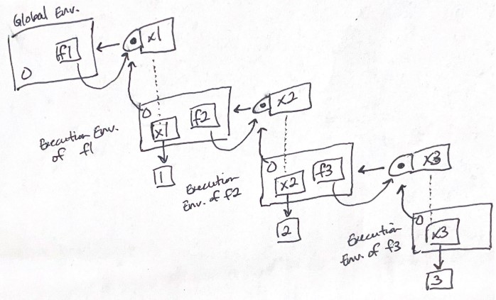

```r
library(rlang)
```

# 7.1 Introduction

## Quiz

1. List at least three ways that an environment differs from a list?

2. What is the parent of the global environment? What is the only environment
that doesn't have a parent?

3. What is the enclosing environment of a function? Why is it important?

4. How do you determine the environment from which a function was called?

5. How are `<-` and `<<-` different?

# 7.2 Environment basics

* environments are similar to a named list except:

  - every name is unique
  
  - names are unordered
  
  - has a parent
  
  - no copy on modify
  
## 7.2.1 Basics


```r
# create environments

# with rlang::env
e1 <- env(
  a = FALSE,
  b = "a",
  c = 2.3,
  d = 1:3,
)

# envrionments can contain themselves
e1$d <- e1

# with base::new.env (from 1st edition of the book)
e <- new.env() # init environment
e$a <- FALSE
e$b <- "a"
e$c <- 2.3
e$d <- 1:3
```


```r
# memory addresses
e1 # just prints address
```

```
## <environment: 0x00000279ad5b7250>
```

```r
env_print(e1) # has more info
```

```
## <environment: 0x00000279ad5b7250>
## Parent: <environment: global>
## Bindings:
## • a: <lgl>
## • b: <chr>
## • c: <dbl>
## • d: <env>
```


```r
# print names
env_names(e1)
```

```
## [1] "a" "b" "c" "d"
```

```r
names(e1)
```

```
## [1] "a" "b" "c" "d"
```

```r
ls(e1, all.names = TRUE)
```

```
## [1] "a" "b" "c" "d"
```

## 7.2.2 Important environments

* current environment `current_env()`: environment where code is currently executing

* global environment `global_env()`: environment where interactive computation takes place

* access global env with `globalenv()` and current env with `environment()`


```r
# environment comparison: use identical()
identical(global_env(), current_env())
```

```
## [1] TRUE
```

```r
#global_env() == current_env()
```

## 7.2.3 Parents

* every environment has a parent environment, used to implement lexical scoping


```r
e2a <- env(d = 4, e = 5)
e2b <- env(e2a, a = 1, b = 2, c = 3)
```


```r
# find parent of an environment with env_parent()
env_parent(e2b)
```

```
## <environment: 0x00000279aa22d9c8>
```

```r
env_parent(e2a)
```

```
## <environment: R_GlobalEnv>
```

* empty environment does not have a parent


```r
e2c <- env(empty_env(), d = 4, e = 5)
e2d <- env(e2c, a = 1, b = 2, c = 3)
```


```r
# can see ancestors with env_parents()
env_parents(e2b) # by default stops at global environment
```

```
## [[1]]   <env: 0x00000279aa22d9c8>
## [[2]] $ <env: global>
```

```r
env_parents(e2d) # ancestors terminate at empty environment
```

```
## [[1]]   <env: 0x00000279aa6fcdb8>
## [[2]] $ <env: empty>
```


```r
# ancestors of global environment includes all attached packages
env_parents(e2b, last = empty_env())
```

```
##  [[1]]   <env: 0x00000279aa22d9c8>
##  [[2]] $ <env: global>
##  [[3]] $ <env: package:rlang>
##  [[4]] $ <env: package:stats>
##  [[5]] $ <env: package:graphics>
##  [[6]] $ <env: package:grDevices>
##  [[7]] $ <env: package:utils>
##  [[8]] $ <env: package:datasets>
##  [[9]] $ <env: package:methods>
## [[10]] $ <env: Autoloads>
## [[11]] $ <env: package:base>
## [[12]] $ <env: empty>
```

* `parent.env()` finds parent of environment

## 7.2.4 Super assignment `<<-`

* `<-` creates a variable in the current environment, `<<-` modifies an existing variable
in a parent env

* if a variable is not found using `<<-`, one is created in the global environment


```r
x <- 0
f <- function() {
  x <<- 1
}
f()
x
```

```
## [1] 1
```

## 7.2.5 Getting and setting

* get and set elements of an environment with `$` and `[[`, but cannot use numeric
indices


```r
e3 <- env(x = 1, y = 2)
e3$x
```

```
## [1] 1
```

```r
e3$z <- 3
e3[["z"]]
```

```
## [1] 3
```

* if binding does not exist, will return `NULL` but can change default value in
`env_get()` or just throw an error

* `env_poke()` takes a name and value to add additional bindings


```r
env_poke(e3, "a", 100)
e3$a
```

```
## [1] 100
```

* `env_bind` to add multiple bindings


```r
env_bind(e3, a = 10, b = 20)
env_names(e3)
```

```
## [1] "x" "y" "z" "a" "b"
```

* `env_has()` to check if binding exists in an env

* `env_unbind()` to unbind objects from env


```r
e3$a <- NULL
env_has(e3, "a")
```

```
##    a 
## TRUE
```

```r
env_unbind(e3, "a")
env_has(e3, "a")
```

```
##     a 
## FALSE
```

* be careful with `get`, `assign`, `exists`, and `rm`: designed to be used interactively

## 7.2.6 Advanced bindings

* `env_bind_lazy()` creates delayed bindings - bindings that are evaluated the first
time they are accessed, useful for accessing data from R packages


```r
env_bind_lazy(current_env(), b = {Sys.sleep(1); 1}) # b not evaluated

system.time(print(b)) # now evaluated
```

```
## [1] 1
```

```
##    user  system elapsed 
##    0.00    0.00    1.01
```

```r
system.time(print(b)) # already loaded in, no need to reevaluate
```

```
## [1] 1
```

```
##    user  system elapsed 
##       0       0       0
```

* `env_bind_active()` creates active bindings - bindings that are recomputed every
time they are accessed, used for R6 active fields


```r
env_bind_active(current_env(), z1 = function(val) runif(1))

z1
```

```
## [1] 0.6675501
```

```r
z1
```

```
## [1] 0.7362366
```

## 7.2.7 Exercises

1. List three ways in which an environment differs from a list.

* environments not copied on modification, cannot be subset using numerical
indices, and each environment has a parent

2. Create an environment as illustrated by this picture.


```r
loop_env <- env()
loop_env$loop <- loop_env
```

3. Create a pair of environments as illustrated by this picture.


```r
deloop_env <- env()
loop_env <- env()

loop_env$loop <- deloop_env
deloop_env$deloop <- loop_env
```

4. Explain why `e[[1]]` and `e[c("a", "b")]` don't make sense when `e` is an environment.

The book mentioned that environments cannot be subset using numeric indices. This
makes sense knowing that environment names are not ordered, unlike lists. 

I'm not sure why accessing multiple environment names would not work.

5. Create a version of `env_poke()` that will only bind new names, never re-bind
old names. Some programming languages only do this, and are known as single assignment
languages.


```r
env_poke_SA <- function(environment, name, value) {
    # check to see if binding in the environment exists
    if(!env_has(environment, name)) { # if binding does not exist
        environment[[name]] <- value # create binding
    }
}

# test with existing e3
env_names(e3)
```

```
## [1] "x" "y" "z" "b"
```

```r
e3$x
```

```
## [1] 1
```

```r
env_poke_SA(e3, "x", 2)
e3$x
```

```
## [1] 1
```

6. What does this function do? How does it differ from `<<-` and why might you
prefer it?

`rebind()` recursively checks through each parent environment to see if `name` exists.
If `name` is found in a parent environment, it is reassigned `value`. If not, it will
check the subsequent parent environment up until the empty environment. `<<-` only
stops at the global environment, not the empty environment, and will create a new
binding in the global environment if the name does not exist.


```r
rebind <- function(name, value, env = caller_env()) {
  if (identical(env, empty_env())) { # check to see if we went back to far, base case
    stop("Can't find `", name, "`", call. = FALSE)
  } else if (env_has(env, name)) {
    env_poke(env, name, value) # reassign value when it exists, terminate recursion
  } else {
    rebind(name, value, env_parent(env)) # recursive call, reduction step
  }
}

#rebind("a", 10)
a <- 5
rebind("a", 10)
a
```

```
## [1] 10
```

# 7.3 Recursing over environments

* `where()` looks for a name starting at a given environment


```r
where <- function(name, env = caller_env()) {
  if (identical(env, empty_env())) {
    # Base case
    stop("Can't find ", name, call. = FALSE)
  } else if (env_has(env, name)) {
    # Success case
    env
  } else {
    # Recursive case
    where(name, env_parent(env))
  }
}
```


```r
#where("yyy")

x <- 5
where("x")
```

```
## <environment: R_GlobalEnv>
```

```r
where("mean")
```

```
## <environment: base>
```

## 7.3.1 Exercises

1. Modify `where()` to return all environments that contain a binding for `name`.
Carefully think through what type of object the function will need to return.


```r
# kind of a cheat solution since function needs an empty vector called env_list to work

#env_list <- c() # init. empty vector
where_all <- function(name, env = caller_env(), env_list = c()) {
  if (identical(env, empty_env())) {
    # Base case, return env_list output
    return(env_list)
  } 
  else {
    if (env_has(env, name)) {
      # Success case, but do not terminate recursive loop
      env_list <- c(env_list, env) # concatenate to env_list
    }
      
    # Recursive call, must terminate at empty env
    where_all(name, env_parent(env), env_list) # also keep current copy of env_list to carry on
  }
}

# test
e4a <- env(empty_env(), a = 1, b = 2)
e4a
```

```
## <environment: 0x00000279aee6bdc8>
```

```r
e4b <- env(e4a, x = 10, a = 11)
e4b
```

```
## <environment: 0x00000279aa2902b8>
```

```r
where_all("a", env = e4b)
```

```
## [[1]]
## <environment: 0x00000279aa2902b8>
## 
## [[2]]
## <environment: 0x00000279aee6bdc8>
```

2. write a function called `fget()` that finds only function objects. It should
have two arguments, `name` and `env`, and should obey the regular scoping rules
for functions: if there's an object with a matching name that's not a function,
look in the parent. For an added challenge, also add an `inherits` argument
which controls whether the function recurses up the parents or only looks
in one environment.


```r
fget <- function(name, env, inherits = TRUE, func_list = c()) {
    # base case, got to empty_env
    if(identical(env, empty_env())) {
        return(func_list)
    } else {
        if(env_has(env, name) & is_function(name)) { # check if it exists in env and is a function
            func_list <- c(func_list, name) # success case
        }
        
        # before recursive call, check if inherits is FALSE
        if(inherits == FALSE) {
            return(func_list) # will break before recursion starts
        }
        
        fget(name, env_parent(env), inherits, func_list) # recursive call
    }
}
```


```r
fget <- function(name, env, inherits = TRUE) {
    # base case, at empty env
    if(identical(env, empty_env())) {
        stop("function not found")
    } else if(env_has(env, name)) {
        # check if object is a function
        object <- env_get(env, name)
        if(is.function(object)) {
            return(object) # terminate recursion
        }
        # if object is not a function, check to see if we need to make recursive call
        if(inherits == FALSE) {
            stop("function not found") # terminate recursion
        }
    }
    
    fget(name, env_parent(env)) # recursive call
}

# test
fget("mean", globalenv())
```

```
## function (x, ...) 
## UseMethod("mean")
## <bytecode: 0x00000279ae07ad08>
## <environment: namespace:base>
```

```r
#fget("asdf", globalenv())

func_e1 <- env(a = mean, empty_env())
func_e2 <- env(a = 1, func_e1)

fget("a", func_e1, inherits = FALSE)
```

```
## function (x, ...) 
## UseMethod("mean")
## <bytecode: 0x00000279ae07ad08>
## <environment: namespace:base>
```

```r
#fget("a", func_e2, inherits = FALSE)
fget("a", func_e2, inherits = TRUE)
```

```
## function (x, ...) 
## UseMethod("mean")
## <bytecode: 0x00000279ae07ad08>
## <environment: namespace:base>
```


# 7.4 Special environments

## 7.4.1 Package environments and the search path

* every attached package becomes one of the parents of the global env, immediate
parent is the latest loaded package

* `base::search()` to see search path or `rlang::search_envs()` to view environments


```r
search()
```

```
##  [1] ".GlobalEnv"        "package:rlang"     "package:stats"    
##  [4] "package:graphics"  "package:grDevices" "package:utils"    
##  [7] "package:datasets"  "package:methods"   "Autoloads"        
## [10] "package:base"
```

```r
search_envs()
```

```
##  [[1]] $ <env: global>
##  [[2]] $ <env: package:rlang>
##  [[3]] $ <env: package:stats>
##  [[4]] $ <env: package:graphics>
##  [[5]] $ <env: package:grDevices>
##  [[6]] $ <env: package:utils>
##  [[7]] $ <env: package:datasets>
##  [[8]] $ <env: package:methods>
##  [[9]] $ <env: Autoloads>
## [[10]] $ <env: package:base>
```

* last two (?) environments: `Autoloads` for delayed bindings, `base` for
base package

## 7.4.2 The function environment

* function environment: function binds to the environment it was created in

* closures: functions that capture their environments


```r
y <- 1
f <- function(x) x + y
fn_env(f) # get function environment
```

```
## <environment: R_GlobalEnv>
```

```r
environment(f) # access environment of f
```

```
## <environment: R_GlobalEnv>
```


```r
# difference between how g is found and how g finds its variables
e <- env()
e$g <- function() 1
```

## 7.4.3 Namespaces

* package environment: the external interface to the package, controls how we find
the function

* namespace environment: internal interface of the package, controls how the function
finds its variables

* bindings in the package environment are also in the namespace environment

* namespace environments have the same set of ancestors:

  - imports environment: contains bindings to all the functions used by the
  package, controlled by `NAMESPACE` file
  
  - base namespace
  
  - global environment

## 7.4.4 Execution environments


```r
g <- function(x) {
  if (!env_has(current_env(), "a")) {
    message("Defining a")
    a <- 1
  } else {
    a <- a + 1
  }
  a
}

g(10)
```

```
## Defining a
```

```
## [1] 1
```

```r
g(10) 
```

```
## Defining a
```

```
## [1] 1
```

```r
# same output because calling a function creates a new environment aka execution environment
# parent of execution environment is function environment
```


```r
h <- function(x) {
  # 1.
  a <- 2 # 2.
  x + a
}

y <- h(1) # 3.

# execution environment is deleted after function is run
# but there are ways to retain execution environment

h2 <- function(x) {
  a <- x * 2
  current_env()
}

e <- h2(x = 10)
env_print(e) # return execution environment
```

```
## <environment: 0x00000279af34f868>
## Parent: <environment: global>
## Bindings:
## • a: <dbl>
## • x: <dbl>
```

```r
fn_env(h2)
```

```
## <environment: R_GlobalEnv>
```


```r
plus <- function(x) {
  function(y) x + y
}

plus_one <- plus(1)
plus_one
```

```
## function(y) x + y
## <environment: 0x00000279aa014658>
```

```r
plus_one(2)
```

```
## [1] 3
```

## 7.4.5 Exercises

1. How is `search_envs()` different from `env_parents(global_env())`?

`search_envs()` prints out the environments in the search path. `env_parents(global_env())`
prints out all the ancestors of the global environment up to the empty environment.


```r
search_envs()
```

```
##  [[1]] $ <env: global>
##  [[2]] $ <env: package:rlang>
##  [[3]] $ <env: package:stats>
##  [[4]] $ <env: package:graphics>
##  [[5]] $ <env: package:grDevices>
##  [[6]] $ <env: package:utils>
##  [[7]] $ <env: package:datasets>
##  [[8]] $ <env: package:methods>
##  [[9]] $ <env: Autoloads>
## [[10]] $ <env: package:base>
```

```r
env_parents(global_env())
```

```
##  [[1]] $ <env: package:rlang>
##  [[2]] $ <env: package:stats>
##  [[3]] $ <env: package:graphics>
##  [[4]] $ <env: package:grDevices>
##  [[5]] $ <env: package:utils>
##  [[6]] $ <env: package:datasets>
##  [[7]] $ <env: package:methods>
##  [[8]] $ <env: Autoloads>
##  [[9]] $ <env: package:base>
## [[10]] $ <env: empty>
```

2. Draw a diagram that shows the enclosing environments of this function:


```r
f1 <- function(x1) {
  f2 <- function(x2) {
    f3 <- function(x3) {
      x1 + x2 + x3
    }
    f3(3)
  }
  f2(2)
}
f1(1)
```

```
## [1] 6
```



3. Write an enhanced version of `str()` that provides more information about functions.
Show where the function was found and what environment it was defined in.


```r
# 1. recursively look for the function
# 2. return function and current environment, stop recursion

function_str <- function(name, env) {
    # base case, at empty env
    if(identical(env, empty_env())) {
        stop("function not found")
    } else if (env_has(env, name)) {
        # check if object is a function
        object <- env_get(env, name)
        if(is.function(object)) {
            return(list(func = object, environment = env))
        }
    }
    function_str(name, env_parent(env)) # recursive call
}

function_str("mean", caller_env())
```

```
## $func
## function (x, ...) 
## UseMethod("mean")
## <bytecode: 0x00000279ae07ad08>
## <environment: namespace:base>
## 
## $environment
## <environment: namespace:base>
```

```r
function_str("fget", caller_env())
```

```
## $func
## function(name, env, inherits = TRUE) {
##     # base case, at empty env
##     if(identical(env, empty_env())) {
##         stop("function not found")
##     } else if(env_has(env, name)) {
##         # check if object is a function
##         object <- env_get(env, name)
##         if(is.function(object)) {
##             return(object) # terminate recursion
##         }
##         # if object is not a function, check to see if we need to make recursive call
##         if(inherits == FALSE) {
##             stop("function not found") # terminate recursion
##         }
##     }
##     
##     fget(name, env_parent(env)) # recursive call
## }
## <bytecode: 0x00000279a9ef1638>
## 
## $environment
## <environment: R_GlobalEnv>
```


# 7.5 Call stacks

* caller environment - `rlang::caller_env()` or `parent.frame()`: environment from which the function
was called

## 7.5.1 Simple call stacks


```r
f <- function(x) {
  g(x = 2)
}
g <- function(x) {
  h(x = 3)
}
h <- function(x) {
  stop()
}

#f(x = 1)
#traceback()

h <- function(x) {
  lobstr::cst()
}
f(x = 1)
```

```
##     ▆
##  1. └─global f(x = 1)
##  2.   └─global g(x = 2)
##  3.     └─global h(x = 3)
##  4.       └─lobstr::cst()
```

## 7.5.2 Lazy evaluation


```r
a <- function(x) b(x)
b <- function(x) c(x)
c <- function(x) x

a(f())
```

```
##     ▆
##  1. ├─global a(f())
##  2. │ └─global b(x)
##  3. │   └─global c(x)
##  4. └─global f()
##  5.   └─global g(x = 2)
##  6.     └─global h(x = 3)
##  7.       └─lobstr::cst()
```

## 7.5.3 Frames

* frame (or evaluation context): element of a call stack

  - an expression `expr` giving the function call
  
  - an environment `env` which is the execution environment of a function
  
  - a parent

## 7.5.4 Dynamic scope

* dynamic scoping: looking up variables in the calling stack rather than in the enclosing
environment

## 7.5.5 Exercises

1. Write a function that lists all the variables defined in the environment
in which it was called. It should return the same results as `ls()`.


```r
ls_env <- function(env = caller_env()) {
    env_names(env)
}

e4a <- env(empty_env(), a = 1, b = 2)
e4a
```

```
## <environment: 0x00000279aecf2540>
```

```r
e4b <- env(e4a, x = 10, a = 11)
e4b
```

```
## <environment: 0x00000279ae2e4470>
```

```r
ls_env(e4a)
```

```
## [1] "a" "b"
```


