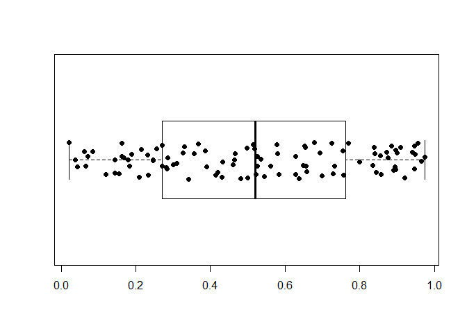

# 9.1 Introduction

* functional: takes a function as an input and returns a vector as output


```r
set.seed(1)

randomise <- function(f) f(runif(1e3))
randomise(mean)
```

```
## [1] 0.4996917
```

```r
randomise(mean)
```

```
## [1] 0.4902962
```

```r
randomise(sum)
```

```
## [1] 489.6972
```

* common examples: R apply family functions, purrr `map()`

# 9.2 My first functional: `map()`


```r
library(purrr)
```

* `map(1:3, f)` equivalent to `list(f(1), f(2), f(3))`


```r
# map(vector, function)

triple <- function(x) x * 3
map(1:3, triple)
```

```
## [[1]]
## [1] 3
## 
## [[2]]
## [1] 6
## 
## [[3]]
## [1] 9
```


```r
# basic implementation of map()

simple_map <- function(x, f, ...) {
  out <- vector("list", length(x))
  for (i in seq_along(x)) {
    out[[i]] <- f(x[[i]], ...)
  }
  out
}
```

* R base equivalent to `purrr::map()` is `lapply()`


## 9.2.1 Producing atomic vectors


```r
# map_chr() always returns a character vector
map_chr(mtcars, typeof)
```

```
##      mpg      cyl     disp       hp     drat       wt     qsec       vs 
## "double" "double" "double" "double" "double" "double" "double" "double" 
##       am     gear     carb 
## "double" "double" "double"
```

```r
# map_lgl() always returns a logical vector
map_lgl(mtcars, is.double)
```

```
##  mpg  cyl disp   hp drat   wt qsec   vs   am gear carb 
## TRUE TRUE TRUE TRUE TRUE TRUE TRUE TRUE TRUE TRUE TRUE
```

```r
# map_int() always returns a integer vector
n_unique <- function(x) length(unique(x))
map_int(mtcars, n_unique)
```

```
##  mpg  cyl disp   hp drat   wt qsec   vs   am gear carb 
##   25    3   27   22   22   29   30    2    2    3    6
```

```r
# map_dbl() always returns a double vector
map_dbl(mtcars, mean)
```

```
##        mpg        cyl       disp         hp       drat         wt       qsec 
##  20.090625   6.187500 230.721875 146.687500   3.596563   3.217250  17.848750 
##         vs         am       gear       carb 
##   0.437500   0.406250   3.687500   2.812500
```


```r
pair <- function(x) c(x, x)
map(1:2, pair)
```

```
## [[1]]
## [1] 1 1
## 
## [[2]]
## [1] 2 2
```

```r
map(1:2, as.character)
```

```
## [[1]]
## [1] "1"
## 
## [[2]]
## [1] "2"
```

* `sapply()` and `vapply()` also outputs atomic vectors

## 9.2.2 Anonymous functions and shortcuts


```r
# inline anonymous function
map_dbl(mtcars, function(x) length(unique(x)))
```

```
##  mpg  cyl disp   hp drat   wt qsec   vs   am gear carb 
##   25    3   27   22   22   29   30    2    2    3    6
```


```r
# purrr shortcut
map_dbl(mtcars, ~ length(unique(.x)))
```

```
##  mpg  cyl disp   hp drat   wt qsec   vs   am gear carb 
##   25    3   27   22   22   29   30    2    2    3    6
```


```r
as_mapper(~ length(unique(.x)))
```

```
## <lambda>
## function (..., .x = ..1, .y = ..2, . = ..1) 
## length(unique(.x))
## attr(,"class")
## [1] "rlang_lambda_function" "function"
```


```r
# extracting elements using map()

x <- list(
  list(-1, x = 1, y = c(2), z = "a"),
  list(-2, x = 4, y = c(5, 6), z = "b"),
  list(-3, x = 8, y = c(9, 10, 11))
)

# Select by name
map_dbl(x, "x")
```

```
## [1] 1 4 8
```

```r
# Or by position
map_dbl(x, 1)
```

```
## [1] -1 -2 -3
```

```r
# Or by both
map_dbl(x, list("y", 1))
```

```
## [1] 2 5 9
```

```r
# You'll get an error if a component doesn't exist:
#map_chr(x, "z")

# Unless you supply a .default value
map_chr(x, "z", .default = NA)
```

```
## [1] "a" "b" NA
```

## 9.2.3 Passing arguments with `...`


```r
x <- list(1:5, c(1:10, NA))
map_dbl(x, ~ mean(.x, na.rm = TRUE))
```

```
## [1] 3.0 5.5
```


```r
# directly pass na.rm to mean(), no need to specify parameters in function call
map_dbl(x, mean, na.rm = TRUE)
```

```
## [1] 3.0 5.5
```

* arguments passed this way are not decomposed! (ie: passing a vector as an argument
will stay as a vector)


```r
plus <- function(x, y) x + y
x <- c(0, 0, 0, 0)

# passing extra arguments in map()
map_dbl(x, plus, runif(1)) # runif() evaluated once
```

```
## [1] 0.8023495 0.8023495 0.8023495 0.8023495
```

```r
# passing extra arguments in anonymous function
map_dbl(x, ~ plus(.x, runif(1))) # runif() evaluated for each index
```

```
## [1] 0.4794952 0.1774016 0.3971333 0.8142270
```

## 9.2.4 Argument names


```r
# can write out full argument names passed through map()
x <- list(1:5, 5:10)
map(x, mean, trim = 0.1)
```

```
## [[1]]
## [1] 3
## 
## [[2]]
## [1] 7.5
```


```r
simple_map <- function(x, f, ...) {
  out <- vector("list", length(x))
  for (i in seq_along(x)) {
    out[[i]] <- f(x[[i]], ...)
  }
  out
}
```


```r
# arguments to map() are .x and .f
boostrap_summary <- function(x, f) {
  f(sample(x, replace = TRUE))
}

#simple_map(mtcars, bootstrap_summary, f = mean)
# really simple_map(x = mtcars, f = mean, bootstrap_summary), bootstrap_summary passed as trim in mean()
```

## 9.2.5 Varying another argument

* How to keep first argument of `map()` constant and vary the argument?


```r
trims_param <- c(0, 0.1, 0.2, 0.5)
vect <- rcauchy(1000)
```

* manually rearrange argument order using an anonymous function


```r
map_dbl(trims_param, ~ mean(vect, trim = .x))
```

```
## [1] -0.33629503  0.05282629  0.04017959  0.01717390
```


```r
# more explicit
map_dbl(trims_param, function(trim) mean(vect, trim = trim))
```

```
## [1] -0.33629503  0.05282629  0.04017959  0.01717390
```

* take advantage of argument matching rules


```r
#map_dbl(trims, mean, x = x)
# this is confusing. no reason to do this
```

## 9.2.6 Exercises

1. Use `as_mapper()` to explore how purrr generates anonymous functions for the integer, character, and list
helpers. What helper allows you to extract attributes? Read the documentation to find out.


```r
as_mapper(1)
```

```
## function (x, ...) 
## pluck_raw(x, list(1), .default = NULL)
## <environment: 0x0000013fd67433e0>
```


```r
as_mapper("a")
```

```
## function (x, ...) 
## pluck_raw(x, list("a"), .default = NULL)
## <environment: 0x0000013fd690cb50>
```


```r
as_mapper(list(1, "a"))
```

```
## function (x, ...) 
## pluck_raw(x, list(1, "a"), .default = NULL)
## <environment: 0x0000013fd6a92b98>
```

If the input is a character vector, numeric vector, or list, it is converted to an
extractor function in `purrr::pluck()`.

2. `map(1:3, ~ runif(2))` is a useful pattern for generating random numbers, but
`map(1:3, runif(2))` is not. Why not? Can you explain why it returns the result
that it does?

`~ runif(2)` is executed for each value in `1:3` while `runif(2)` is executed only
one time BUT why are vector values returned?


```r
map(1:3, ~ runif(2))
```

```
## [[1]]
## [1] 0.3811821 0.6982137
## 
## [[2]]
## [1] 0.6887658 0.4777307
## 
## [[3]]
## [1] 0.2733476 0.7569163
```

```r
# map(1:3, function(x) runif(2))
```


```r
as_mapper(~ runif(2))
```

```
## <lambda>
## function (..., .x = ..1, .y = ..2, . = ..1) 
## runif(2)
## attr(,"class")
## [1] "rlang_lambda_function" "function"
```


```r
map(1:3, runif(2))
```

```
## [[1]]
## [1] 1
## 
## [[2]]
## [1] 2
## 
## [[3]]
## [1] 3
```


```r
as_mapper(runif(2))
```

```
## function (x, ...) 
## pluck_raw(x, list(0.612843240844086, 0.0950499763712287), .default = NULL)
## <environment: 0x0000013fd7235fe0>
```


```r
v <- 1:3
rand <- as.list(runif(2)) # rand will always be a double < 1

# from as_mapper(runif(2)) output, I would expect two values to be output since
# runif(2) will generate two random values
# also pluck() behavior
pluck(v[1], rand[[1]], .default = NULL)
```

```
## [1] 1
```

```r
pluck(v[1], rand[[2]], .default = NULL)
```

```
## [1] 1
```

```r
# input and output vectors must have same dimensions and indices < 1 are treated as 1 as opposed to regular vector behavior
# returning empty vectors

v[rand[[1]]]
```

```
## integer(0)
```

```r
# but executing pluck() verbosely from as_mapper() throws an error since v[1] and rand dims are not equal
#pluck(v[1], rand, .default = NULL)
#pluck(v, rand, .default = NULL)

# also pluck_raw() doesn't exist, probably a C wrapper idk
```

3. Use the appropriate `map()` function to:

a. Compute the standard deviation of every column in a numeric data frame.


```r
map_dbl(mtcars, ~ sd(.x))
```

```
##         mpg         cyl        disp          hp        drat          wt 
##   6.0269481   1.7859216 123.9386938  68.5628685   0.5346787   0.9784574 
##        qsec          vs          am        gear        carb 
##   1.7869432   0.5040161   0.4989909   0.7378041   1.6152000
```

b. Compute the standard deviation of every numeric column in a mixed data frame.
(Hint: you'll need to do it in two steps.)


```r
library(tidyverse)
```

```
## ── Attaching packages ─────────────────────────────────────── tidyverse 1.3.2 ──
## ✔ ggplot2 3.4.0      ✔ dplyr   1.0.10
## ✔ tibble  3.1.8      ✔ stringr 1.5.0 
## ✔ tidyr   1.2.1      ✔ forcats 0.5.2 
## ✔ readr   2.1.3      
## ── Conflicts ────────────────────────────────────────── tidyverse_conflicts() ──
## ✖ dplyr::filter() masks stats::filter()
## ✖ dplyr::lag()    masks stats::lag()
```

```r
mtcars_mixed <- rownames_to_column(mtcars, "name")

#map_dbl(mtcars_mixed, ~ sd(.x)) # will introduce NAs

# determine which columns are numeric
num_col <- map_lgl(mtcars_mixed, is.numeric)

# subset numeric columns and calculate sd
map_dbl(mtcars_mixed[num_col], ~ sd(.x))
```

```
##         mpg         cyl        disp          hp        drat          wt 
##   6.0269481   1.7859216 123.9386938  68.5628685   0.5346787   0.9784574 
##        qsec          vs          am        gear        carb 
##   1.7869432   0.5040161   0.4989909   0.7378041   1.6152000
```

c. Compute the number of levels for every factor in a data frame.


```r
factor_col <- map_lgl(iris, is.factor)
map_int(iris[factor_col], ~ length(levels(.x)))
```

```
## Species 
##       3
```

4. The following code simulates the performance of a t-test for non-normal data.
Extract the p-value from each test, then visualize.


```r
trials <- map(1:100, ~ t.test(rpois(10, 10), rpois(7, 10)))
p_vals <- map_dbl(trials, "p.value")

boxplot(p_vals, col = "white", horizontal = T)
stripchart(p_vals, method = "jitter", pch = 19, add = TRUE)
```

<!-- -->

5. The following code uses a map nested inside another map to apply a function to every
element of a nested list. Why does it fail, and what do you need to do to make it work?


```r
x <- list(
  list(1, c(3, 9)),
  list(c(3, 6), 7, c(4, 7, 6))
)

triple <- function(x) x * 3
# map(x, map, .f = triple)
# map is passed to triple() as an argument

#map(x, ~ map(triple(.x)))
map(x, ~ map(.x, triple))
```

```
## [[1]]
## [[1]][[1]]
## [1] 3
## 
## [[1]][[2]]
## [1]  9 27
## 
## 
## [[2]]
## [[2]][[1]]
## [1]  9 18
## 
## [[2]][[2]]
## [1] 21
## 
## [[2]][[3]]
## [1] 12 21 18
```

6. Use `map()` to fit linear models to the `mtcars` dataset using the formulas stored in
this list:


```r
formulas <- list(
  mpg ~ disp,
  mpg ~ I(1 / disp),
  mpg ~ disp + wt,
  mpg ~ I(1 / disp) + wt
)

fit_models <- map(formulas, lm, data = mtcars)
```

7. Fit the model `mpg ~ disp` to each of the bootstrap replicates of `mtcars` in the
list below, then extract the $R^2$ of the model fit (Hint: you can compute the $R^2$
with `summary()`.)


```r
set.seed(1)
bootstrap <- function(df) {
  df[sample(nrow(df), replace = TRUE), , drop = FALSE]
}

bootstraps <- map(1:10, ~ bootstrap(mtcars))
mod <- mpg ~ disp
mod_fit <- map(bootstraps, ~ lm(mod, data = .x))

# summarize across and extract r.squared
map(map(mod_fit, summary), "r.squared")
```

```
## [[1]]
## [1] 0.5491998
## 
## [[2]]
## [1] 0.6804651
## 
## [[3]]
## [1] 0.6946612
## 
## [[4]]
## [1] 0.7952022
## 
## [[5]]
## [1] 0.8062361
## 
## [[6]]
## [1] 0.8057083
## 
## [[7]]
## [1] 0.8061748
## 
## [[8]]
## [1] 0.6943378
## 
## [[9]]
## [1] 0.6041705
## 
## [[10]]
## [1] 0.6102182
```

```r
# one liner possible but will look ugly or just pipe (section 9.3)
```

# 9.3 Purrr style

* just pipe map using `%>%` (or R base functions) to make code more readable


```r
by_cyl <- split(mtcars, mtcars$cyl)

by_cyl %>% 
  map(~ lm(mpg ~ wt, data = .x)) %>% 
  map(coef) %>% 
  map_dbl(2)
```

```
##         4         6         8 
## -5.647025 -2.780106 -2.192438
```

# 9.4 Map variants

* output same type as input with `modify()`

* iterate over two inputs with `map2()`

* iterate with index using `imap()`

* return nothing with `walk()`

* iterate over any number of inputs with `pmap()`

## Same type of output as input: `modify()`

* `map()` always returns a list, use `modify()` to return the same type of output
as the input


```r
df <- data.frame(
  x = 1:3,
  y = 6:4
)

map(df, ~ .x * 2)
```

```
## $x
## [1] 2 4 6
## 
## $y
## [1] 12 10  8
```

```r
modify(df, ~ .x * 2)
```

```
##   x  y
## 1 2 12
## 2 4 10
## 3 6  8
```

* `modify()` returns modified copy


```r
simple_modify <- function(x, f, ...) {
  for (i in seq_along(x)) {
    x[[i]] <- f(x[[i]], ...)
  }
  x
}
```

## Two inputs: `map2()` and friends


```r
xs <- map(1:8, ~ runif(10))
xs[[1]][[1]] <- NA
ws <- map(1:8, ~ rpois(10, 5) + 1)

map_dbl(xs, mean) # unweighted means
```

```
## [1]        NA 0.5083922 0.4773490 0.5305232 0.4917132 0.4668929 0.5806994
## [8] 0.3697381
```

```r
# can't pass ws as an additional argument
#map_dbl(xs, weighted.mean, w = ws)
```


```r
# map2() is vectorized over two arguments, .x and .y to each call to .f
map2_dbl(xs, ws, weighted.mean)
```

```
## [1]        NA 0.5717518 0.4624765 0.5406618 0.5216602 0.5134765 0.5690446
## [8] 0.3798614
```


```r
# basic implementation
simple_map2 <- function(x, y, f, ...) {
  out <- vector("list", length(x))
  for (i in seq_along(x)) {
    out[[i]] <- f(x[[i]], y[[i]], ...)
  }
  out
}

# actual map2() will recycle inputs!
```

## 9.4.3 No outputs: `walk()` and friends

* not all functions are needed for their output values but for their side effects
(`cat()`, `write.csv()`, `ggsave()`)


```r
welcome <- function(x) {
  cat("Welcome ", x, "!\n", sep = "")
}
names <- c("Hadley", "Jenny")

# As well as generate the welcomes, it also shows 
# the return value of cat()
map(names, welcome)
```

```
## Welcome Hadley!
## Welcome Jenny!
```

```
## [[1]]
## NULL
## 
## [[2]]
## NULL
```


```r
# walk() ignores the return values of .f and returns .x invisibly
walk(names, welcome)
```

```
## Welcome Hadley!
## Welcome Jenny!
```

## 9.4.4 Iterating over values and indices


```r
imap_chr(iris, ~ paste0("The first value of ", .y, " is ", .x[[1]]))
```

```
##                             Sepal.Length 
## "The first value of Sepal.Length is 5.1" 
##                              Sepal.Width 
##  "The first value of Sepal.Width is 3.5" 
##                             Petal.Length 
## "The first value of Petal.Length is 1.4" 
##                              Petal.Width 
##  "The first value of Petal.Width is 0.2" 
##                                  Species 
##   "The first value of Species is setosa"
```


```r
x <- map(1:6, ~ sample(1000, 10))
imap_chr(x, ~ paste0("The highest value of ", .y, " is ", max(.x)))
```

```
## [1] "The highest value of 1 is 969" "The highest value of 2 is 797"
## [3] "The highest value of 3 is 999" "The highest value of 4 is 969"
## [5] "The highest value of 5 is 858" "The highest value of 6 is 902"
```

## 9.4.5 Any number of inputs: `pmap()` and friends

* `pmap(list(x, y, z, etc...), f, additional_args)`

* `tibble::tribble()` allows user to describe a dataframe row-by-row


```r
params <- tibble::tribble(
  ~ n, ~ min, ~ max,
   1L,     0,     1,
   2L,    10,   100,
   3L,   100,  1000
)

pmap(params, runif)
```

```
## [[1]]
## [1] 0.9556758
## 
## [[2]]
## [1] 68.80145 39.58693
## 
## [[3]]
## [1] 277.4320 203.8081 996.3689
```

```r
# runif(n, min, max)
```

* `pmap()` base equivalents: `Map()` and `mapply()`

## 9.4.6 Exercises

1. Explain the results of `modify(mtcars, 1)`.

Since `mtcars` is a dataframe, the output will also be a dataframe. The `1` refers to the
first row of data in `mtcars` and is mapped to every row of `mtcars` which means the 32 rows
of the output will reflect the first row of `mtcars`


```r
modify(mtcars, 1)
```

```
##    mpg cyl disp  hp drat   wt  qsec vs am gear carb
## 1   21   6  160 110  3.9 2.62 16.46  0  1    4    4
## 2   21   6  160 110  3.9 2.62 16.46  0  1    4    4
## 3   21   6  160 110  3.9 2.62 16.46  0  1    4    4
## 4   21   6  160 110  3.9 2.62 16.46  0  1    4    4
## 5   21   6  160 110  3.9 2.62 16.46  0  1    4    4
## 6   21   6  160 110  3.9 2.62 16.46  0  1    4    4
## 7   21   6  160 110  3.9 2.62 16.46  0  1    4    4
## 8   21   6  160 110  3.9 2.62 16.46  0  1    4    4
## 9   21   6  160 110  3.9 2.62 16.46  0  1    4    4
## 10  21   6  160 110  3.9 2.62 16.46  0  1    4    4
## 11  21   6  160 110  3.9 2.62 16.46  0  1    4    4
## 12  21   6  160 110  3.9 2.62 16.46  0  1    4    4
## 13  21   6  160 110  3.9 2.62 16.46  0  1    4    4
## 14  21   6  160 110  3.9 2.62 16.46  0  1    4    4
## 15  21   6  160 110  3.9 2.62 16.46  0  1    4    4
## 16  21   6  160 110  3.9 2.62 16.46  0  1    4    4
## 17  21   6  160 110  3.9 2.62 16.46  0  1    4    4
## 18  21   6  160 110  3.9 2.62 16.46  0  1    4    4
## 19  21   6  160 110  3.9 2.62 16.46  0  1    4    4
## 20  21   6  160 110  3.9 2.62 16.46  0  1    4    4
## 21  21   6  160 110  3.9 2.62 16.46  0  1    4    4
## 22  21   6  160 110  3.9 2.62 16.46  0  1    4    4
## 23  21   6  160 110  3.9 2.62 16.46  0  1    4    4
## 24  21   6  160 110  3.9 2.62 16.46  0  1    4    4
## 25  21   6  160 110  3.9 2.62 16.46  0  1    4    4
## 26  21   6  160 110  3.9 2.62 16.46  0  1    4    4
## 27  21   6  160 110  3.9 2.62 16.46  0  1    4    4
## 28  21   6  160 110  3.9 2.62 16.46  0  1    4    4
## 29  21   6  160 110  3.9 2.62 16.46  0  1    4    4
## 30  21   6  160 110  3.9 2.62 16.46  0  1    4    4
## 31  21   6  160 110  3.9 2.62 16.46  0  1    4    4
## 32  21   6  160 110  3.9 2.62 16.46  0  1    4    4
```

```r
mtcars[1, ]
```

```
##           mpg cyl disp  hp drat   wt  qsec vs am gear carb
## Mazda RX4  21   6  160 110  3.9 2.62 16.46  0  1    4    4
```

```r
dim(mtcars)
```

```
## [1] 32 11
```


2. Rewrite the following code to use `iwalk()` instead of `walk2()`. What are
the advantages and disadvantages?


```r
cyls <- split(mtcars, mtcars$cyl)
temp <- "./"
paths <- file.path(temp, paste0("cyl-", names(cyls), ".csv"))
walk2(cyls, paths, write.csv)
```


```r
# imap(x,f) is equivalent to map2(x, names(x), f)
cyls <- split(mtcars, mtcars$cyl)
temp <- "./"
names(cyls) <- file.path(temp, paste0("cyl-", names(cyls), ".csv"))
iwalk(cyls, write.csv)
```


3. Explain how the following code transforms a data frame using functions
stored in a list.


```r
trans <- list(
  disp = function(x) x * 0.0163871,
  am = function(x) factor(x, labels = c("auto", "manual"))
)

nm <- names(trans) # only mutate on disp and am cols
mtcars[nm] <- map2(trans, mtcars[nm], function(f, var) f(var)) # for each function in trans, mutate on disp and am cols
                                                               # in mtcars; execute function on specific col
```

Compare and contrast the `map2()` approach to this `map()` approach:


```r
mtcars[nm] <- map(nm, ~ trans[[.x]](mtcars[[.x]]))
                        # analogous to function(f, var) f(var)
# trans[[.x]] either disp() or am() FUNCTION
# mtcars[[.x]] refers to actual mtcars col
```


```r
as_mapper(~ trans[[.x]](mtcars[[.x]]))
```

```
## <lambda>
## function (..., .x = ..1, .y = ..2, . = ..1) 
## trans[[.x]](mtcars[[.x]])
## attr(,"class")
## [1] "rlang_lambda_function" "function"
```

4. What does `write.csv()` return, i.e. what happens if you use it with `map2()` instead
of `walk2()`?

Returns `NULL`


```r
cyls <- split(mtcars, mtcars$cyl)
temp <- "./"
paths <- file.path(temp, paste0("cyl-", names(cyls), ".csv"))
map2(cyls, paths, write.csv)
```

```
## $`4`
## NULL
## 
## $`6`
## NULL
## 
## $`8`
## NULL
```


