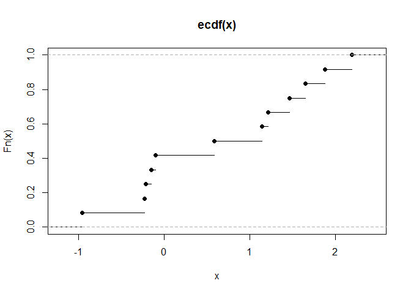
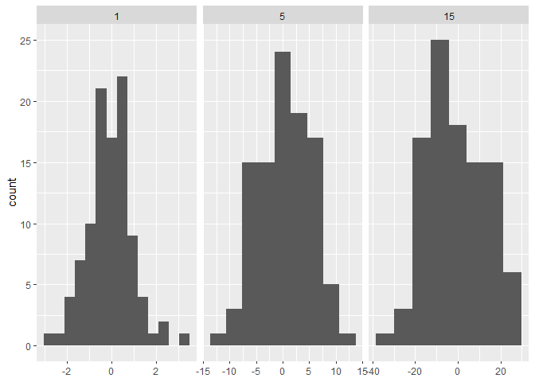

# 10.1 Introduction

* function factory: function that makes functions


```r
power1 <- function(exp) {
  function(x) {
    x ^ exp
  }
}

# manufactured functions
square <- power1(2)
cube <- power1(3)

square
```

```
## function(x) {
##     x ^ exp
##   }
## <environment: 0x0000018ffea2fa38>
```

```r
cube
```

```
## function(x) {
##     x ^ exp
##   }
## <bytecode: 0x0000018ffcf712f0>
## <environment: 0x0000018ffe58c1e8>
```

```r
square(3)
```

```
## [1] 9
```

```r
cube(3)
```

```
## [1] 27
```


```r
library(rlang)
library(ggplot2)
library(scales)
```


# 10.2 Factory fundamentals

* the enclosing environment of the manufactured function is an execution environment
of the function factory

## 10.2.1 Environments


```r
square
```

```
## function(x) {
##     x ^ exp
##   }
## <environment: 0x0000018ffea2fa38>
```

```r
cube
```

```
## function(x) {
##     x ^ exp
##   }
## <bytecode: 0x0000018ffcf712f0>
## <environment: 0x0000018ffe58c1e8>
```


```r
env_print(square)
```

```
## <environment: 0x0000018ffea2fa38>
## Parent: <environment: global>
## Bindings:
## • exp: <dbl>
```

```r
env_print(cube)
```

```
## <environment: 0x0000018ffe58c1e8>
## Parent: <environment: global>
## Bindings:
## • exp: <dbl>
```

```r
# separate environments for square() and cube()
```


```r
# get exp value from each function environment
fn_env(square)$exp
```

```
## [1] 2
```

```r
fn_env(cube)$exp
```

```
## [1] 3
```

## 10.2.3 Forcing evaluation


```r
x <- 2
square <- power1(x) # call function factory
x <- 3 # change binding
```


```r
# call manufactured function
square(2) # expect x ^ 2 = 2 ^ 2 since x in line 65 is input to power1(x)
```

```
## [1] 8
```

```r
# but returns 8
# occurs when a binding changes in between calling the function factory and the manufactured function
```


```r
# circumvent by forcing evaluation with force()
power2 <- function(exp) {
  force(exp) # exp now static
  function(x) {
    x ^ exp
  }
}

x <- 2
square <- power2(x)
x <- 3
square(2) # changing bindings between calling fxn factory and manufactured fxn does not change exp
```

```
## [1] 4
```

## 10.2.4 Stateful functions


```r
new_counter <- function() {
  i <- 0
  
  function() {
    i <<- i + 1
    i
  }
}

counter_one <- new_counter()
counter_two <- new_counter()
```


```r
counter_one()
```

```
## [1] 1
```

```r
counter_one()
```

```
## [1] 2
```

```r
counter_two()
```

```
## [1] 1
```

* better to switch to R6 for managing multiple variables

## 10.2.5 Garbage collection


```r
f1 <- function(n) {
  x <- runif(n)
  m <- mean(x)
  function() m
}

g1 <- f1(1e6)
lobstr::obj_size(g1)
```

```
## 8.01 MB
```

```r
f2 <- function(n) {
  x <- runif(n)
  m <- mean(x)
  rm(x)
  function() m
}

g2 <- f2(1e6)
lobstr::obj_size(g2)
```

```
## 13.04 kB
```

## 10.2.6 Exercises

1. The definition of `force()` is simple:


```r
force
```

```
## function (x) 
## x
## <bytecode: 0x0000018ffbdacbd0>
## <environment: namespace:base>
```

Why is it better to `force(x)` instead of just `x`?

We use `force(x)` to override lazy evaluation.

2. Base R contains two function factories, `approxfun()` and `ecdf()`. Read their
documentation and experiment to figure out what the functions do and what they return.


```r
x <- 1:10
y <- rnorm(10)
fun <- approxfun(x, y) # returns a function
curve(fun(x), 0, 11, col = "green2")
points(x, y)
```

<!-- -->


```r
# empirical cumulative distribution function
x <- rnorm(12)
Fn <- ecdf(x)
Fn
```

```
## Empirical CDF 
## Call: ecdf(x)
##  x[1:12] = -1.289, -0.81683, -0.29216,  ..., 1.3041, 1.5297
```

```r
Fn(x)
```

```
##  [1] 0.66666667 0.91666667 0.41666667 0.83333333 0.33333333 0.58333333
##  [7] 1.00000000 0.08333333 0.75000000 0.25000000 0.16666667 0.50000000
```

```r
plot(Fn)
```

<!-- -->

3. Create a function `pick()` that takes an index, `i`, as an argument and returns a function
with an argument `x` that subsets `x` with `i`.


```r
pick <- function(i) {
  function(x) {
    x[[i]]
  }
}
```


```r
unlist(lapply(mtcars, pick(5)))
```

```
##    mpg    cyl   disp     hp   drat     wt   qsec     vs     am   gear   carb 
##  18.70   8.00 360.00 175.00   3.15   3.44  17.02   0.00   0.00   3.00   2.00
```


```r
unlist(lapply(mtcars, function(x) x[[5]]))
```

```
##    mpg    cyl   disp     hp   drat     wt   qsec     vs     am   gear   carb 
##  18.70   8.00 360.00 175.00   3.15   3.44  17.02   0.00   0.00   3.00   2.00
```

4. Create a function that creates functions that compute the ith central moment
of a numeric vector. You can test it by running the following code:


```r
# https://www.r-tutor.com/elementary-statistics/numerical-measures/moment
# i is the kth central moment
# x is the input sample data
moment <- function(i) {
  function(x) {
    (1 / length(x)) * sum((x - mean(x)) ^ i)
  }
}
```


```r
m1 <- moment(1)
m2 <- moment(2)

x <- runif(100)
stopifnot(all.equal(m1(x), 0))
stopifnot(all.equal(m2(x), var(x) * 99 / 100))
```

5. What happens if you don't use a closure? Make predictions, then verify with the
code below.


```r
i <- 0
new_counter2 <- function() {
  i <<- i + 1
  i
}
```

Since `i` will be stored in the global environment, it can be changed with simple
assignment.


```r
new_counter2()
```

```
## [1] 1
```

```r
new_counter2()
```

```
## [1] 2
```

```r
# skip
i <- 100
new_counter2()
```

```
## [1] 101
```

6. What happens if you use `<-` instead of `<<-`? Make predictions, then verify with the 
code below.


```r
new_counter3 <- function() {
  i <- 0 # will always return 1
  function() {
    i <- i + 1
    i
  }
}
```


```r
c3 <- new_counter3()
c3()
```

```
## [1] 1
```

```r
c3()
```

```
## [1] 1
```

```r
c3()
```

```
## [1] 1
```

# 10.3 Graphical factories

## 10.3.1 Labelling


```r
# scales library
y <- c(12345, 123456, 1234567)
comma_format()(y)
```

```
## [1] "12,345"    "123,456"   "1,234,567"
```

```r
number_format(scale = 1e-3, suffix = " K")(y)
```

```
## [1] "12 K"    "123 K"   "1 235 K"
```


```r
df <- data.frame(x = 1, y = y)
core <- ggplot(df, aes(x, y)) + 
  geom_point() + 
  scale_x_continuous(breaks = 1, labels = NULL) +
  labs(x = NULL, y = NULL)
  
core
```

<!-- -->

```r
core + scale_y_continuous(
  labels = comma_format()
)
```

<!-- -->

```r
core + scale_y_continuous(
  labels = number_format(scale = 1e-3, suffix = " K")
)
```

<!-- -->

```r
core + scale_y_continuous(
  labels = scientific_format()
)
```

<!-- -->

## 10.3.2 Histogram bins


```r
# construct some sample data with very different numbers in each cell
sd <- c(1, 5, 15)
n <- 100

df <- data.frame(x = rnorm(3 * n, sd = sd), sd = rep(sd, n))

ggplot(df, aes(x)) + 
  geom_histogram(binwidth = 2) + 
  facet_wrap(~ sd, scales = "free_x") + 
  labs(x = NULL)
```

<!-- -->


```r
binwidth_bins <- function(n) {
  force(n)
  
  function(x) {
    (max(x) - min(x)) / n
  }
}

ggplot(df, aes(x)) + 
  geom_histogram(binwidth = binwidth_bins(20)) + 
  facet_wrap(~ sd, scales = "free_x") + 
  labs(x = NULL)
```

<!-- -->


```r
base_bins <- function(type) {
  fun <- switch(type,
    Sturges = nclass.Sturges,
    scott = nclass.scott,
    FD = nclass.FD,
    stop("Unknown type", call. = FALSE)
  )
  
  function(x) {
    (max(x) - min(x)) / fun(x)
  }
}

ggplot(df, aes(x)) + 
  geom_histogram(binwidth = base_bins("FD")) + 
  facet_wrap(~ sd, scales = "free_x") + 
  labs(x = NULL)
```

<!-- -->

## 10.3.3 `ggsave()`


```r
plot_dev <- function(ext, dpi = 96) {
  force(dpi)
  
  switch(ext,
    eps =  ,
    ps  =  function(path, ...) {
      grDevices::postscript(
        file = filename, ..., onefile = FALSE, 
        horizontal = FALSE, paper = "special"
      )
    },
    pdf = function(filename, ...) grDevices::pdf(file = filename, ...),
    svg = function(filename, ...) svglite::svglite(file = filename, ...),
    emf = ,
    wmf = function(...) grDevices::win.metafile(...),
    png = function(...) grDevices::png(..., res = dpi, units = "in"),
    jpg = ,
    jpeg = function(...) grDevices::jpeg(..., res = dpi, units = "in"),
    bmp = function(...) grDevices::bmp(..., res = dpi, units = "in"),
    tiff = function(...) grDevices::tiff(..., res = dpi, units = "in"),
    stop("Unknown graphics extension: ", ext, call. = FALSE)
  )
}

plot_dev("pdf")
```

```
## function(filename, ...) grDevices::pdf(file = filename, ...)
## <bytecode: 0x0000018f8646f390>
## <environment: 0x0000018f8616cec8>
```

```r
plot_dev("png")
```

```
## function(...) grDevices::png(..., res = dpi, units = "in")
## <bytecode: 0x0000018f86644f80>
## <environment: 0x0000018f869d9988>
```

## 10.3.4 Exercises

1. Compare and contrast `ggplot2::label_bquote()` with `scales::number_format()`.


```r
p <- ggplot(mtcars, aes(wt, mpg)) + geom_point()
p + facet_grid(vs ~ ., labeller = label_bquote(alpha ^ .(vs)))
```

<!-- -->

```r
#p + facet_grid(. ~ vs, labeller = label_bquote(cols = .(vs) ^ .(vs)))
#p + facet_grid(. ~ vs + am, labeller = label_bquote(cols = .(am) ^ .(vs)))
```


