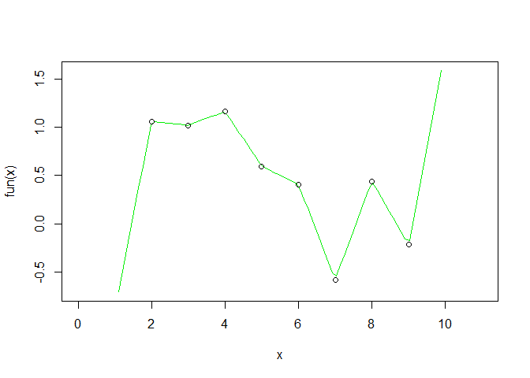

# 10.1 Introduction

* function factory: function that makes functions


```r
power1 <- function(exp) {
  function(x) {
    x ^ exp
  }
}

# manufactured functions
square <- power1(2)
cube <- power1(3)

square
```

```
## function(x) {
##     x ^ exp
##   }
## <environment: 0x0000023e620d0ca8>
```

```r
cube
```

```
## function(x) {
##     x ^ exp
##   }
## <bytecode: 0x0000023e620b6b68>
## <environment: 0x0000023e6213c980>
```

```r
square(3)
```

```
## [1] 9
```

```r
cube(3)
```

```
## [1] 27
```


```r
library(rlang)
library(ggplot2)
library(scales)
```


# 10.2 Factory fundamentals

* the enclosing environment of the manufactured function is an execution environment
of the function factory

## 10.2.1 Environments


```r
square
```

```
## function(x) {
##     x ^ exp
##   }
## <environment: 0x0000023e620d0ca8>
```

```r
cube
```

```
## function(x) {
##     x ^ exp
##   }
## <bytecode: 0x0000023e620b6b68>
## <environment: 0x0000023e6213c980>
```


```r
env_print(square)
```

```
## <environment: 0x0000023e620d0ca8>
## Parent: <environment: global>
## Bindings:
## • exp: <dbl>
```

```r
env_print(cube)
```

```
## <environment: 0x0000023e6213c980>
## Parent: <environment: global>
## Bindings:
## • exp: <dbl>
```

```r
# separate environments for square() and cube()
```


```r
# get exp value from each function environment
fn_env(square)$exp
```

```
## [1] 2
```

```r
fn_env(cube)$exp
```

```
## [1] 3
```

## 10.2.3 Forcing evaluation


```r
x <- 2
square <- power1(x) # call function factory
x <- 3 # change binding
```


```r
# call manufactured function
square(2) # expect x ^ 2 = 2 ^ 2 since x in line 65 is input to power1(x)
```

```
## [1] 8
```

```r
# but returns 8
# occurs when a binding changes in between calling the function factory and the manufactured function
```


```r
# circumvent by forcing evaluation with force()
power2 <- function(exp) {
  force(exp) # exp now static
  function(x) {
    x ^ exp
  }
}

x <- 2
square <- power2(x)
x <- 3
square(2) # changing bindings between calling fxn factory and manufactured fxn does not change exp
```

```
## [1] 4
```

## 10.2.4 Stateful functions


```r
new_counter <- function() {
  i <- 0
  
  function() {
    i <<- i + 1
    i
  }
}

counter_one <- new_counter()
counter_two <- new_counter()
```


```r
counter_one()
```

```
## [1] 1
```

```r
counter_one()
```

```
## [1] 2
```

```r
counter_two()
```

```
## [1] 1
```

* better to switch to R6 for managing multiple variables

## 10.2.5 Garbage collection


```r
f1 <- function(n) {
  x <- runif(n)
  m <- mean(x)
  function() m
}

g1 <- f1(1e6)
lobstr::obj_size(g1)
```

```
## 8.01 MB
```

```r
f2 <- function(n) {
  x <- runif(n)
  m <- mean(x)
  rm(x)
  function() m
}

g2 <- f2(1e6)
lobstr::obj_size(g2)
```

```
## 13.04 kB
```

## 10.2.6 Exercises

1. The definition of `force()` is simple:


```r
force
```

```
## function (x) 
## x
## <bytecode: 0x0000023e5f956c30>
## <environment: namespace:base>
```

Why is it better to `force(x)` instead of just `x`?

We use `force(x)` to override lazy evaluation.

2. Base R contains two function factories, `approxfun()` and `ecdf()`. Read their
documentation and experiment to figure out what the functions do and what they return.


```r
x <- 1:10
y <- rnorm(10)
fun <- approxfun(x, y) # returns a function
curve(fun(x), 0, 11, col = "green2")
points(x, y)
```

<!-- -->


```r
# empirical cumulative distribution function
x <- rnorm(12)
Fn <- ecdf(x)
Fn
```

```
## Empirical CDF 
## Call: ecdf(x)
##  x[1:12] = -0.96056, -0.2294, -0.21874,  ..., 1.8791, 2.1935
```

```r
Fn(x)
```

```
##  [1] 0.91666667 0.83333333 0.16666667 1.00000000 0.41666667 0.08333333
##  [7] 0.58333333 0.33333333 0.25000000 0.50000000 0.66666667 0.75000000
```

```r
plot(Fn)
```

<!-- -->

3. Create a function `pick()` that takes an index, `i`, as an argument and returns a function
with an argument `x` that subsets `x` with `i`.


```r
pick <- function(i) {
  function(x) {
    x[[i]]
  }
}
```


```r
unlist(lapply(mtcars, pick(5)))
```

```
##    mpg    cyl   disp     hp   drat     wt   qsec     vs     am   gear   carb 
##  18.70   8.00 360.00 175.00   3.15   3.44  17.02   0.00   0.00   3.00   2.00
```


```r
unlist(lapply(mtcars, function(x) x[[5]]))
```

```
##    mpg    cyl   disp     hp   drat     wt   qsec     vs     am   gear   carb 
##  18.70   8.00 360.00 175.00   3.15   3.44  17.02   0.00   0.00   3.00   2.00
```

4. Create a function that creates functions that compute the ith central moment
of a numeric vector. You can test it by running the following code:


```r
# https://www.r-tutor.com/elementary-statistics/numerical-measures/moment
# i is the kth central moment
# x is the input sample data
moment <- function(i) {
  function(x) {
    (1 / length(x)) * sum((x - mean(x)) ^ i)
  }
}
```


```r
m1 <- moment(1)
m2 <- moment(2)

x <- runif(100)
stopifnot(all.equal(m1(x), 0))
stopifnot(all.equal(m2(x), var(x) * 99 / 100))
```

5. What happens if you don't use a closure? Make predictions, then verify with the
code below.


```r
i <- 0
new_counter2 <- function() {
  i <<- i + 1
  i
}
```

Since `i` will be stored in the global environment, it can be changed with simple
assignment.


```r
new_counter2()
```

```
## [1] 1
```

```r
new_counter2()
```

```
## [1] 2
```

```r
# skip
i <- 100
new_counter2()
```

```
## [1] 101
```

6. What happens if you use `<-` instead of `<<-`? Make predictions, then verify with the 
code below.


```r
new_counter3 <- function() {
  i <- 0 # will always return 1
  function() {
    i <- i + 1
    i
  }
}
```


```r
c3 <- new_counter3()
c3()
```

```
## [1] 1
```

```r
c3()
```

```
## [1] 1
```

```r
c3()
```

```
## [1] 1
```

# 10.3 Graphical factories

## 10.3.1 Labelling


```r
# scales library
y <- c(12345, 123456, 1234567)
comma_format()(y)
```

```
## [1] "12,345"    "123,456"   "1,234,567"
```

```r
number_format(scale = 1e-3, suffix = " K")(y)
```

```
## [1] "12 K"    "123 K"   "1 235 K"
```


```r
df <- data.frame(x = 1, y = y)
core <- ggplot(df, aes(x, y)) + 
  geom_point() + 
  scale_x_continuous(breaks = 1, labels = NULL) +
  labs(x = NULL, y = NULL)
  
core
```

<!-- -->

```r
core + scale_y_continuous(
  labels = comma_format()
)
```

<!-- -->

```r
core + scale_y_continuous(
  labels = number_format(scale = 1e-3, suffix = " K")
)
```

<!-- -->

```r
core + scale_y_continuous(
  labels = scientific_format()
)
```

<!-- -->

## 10.3.2 Histogram bins


```r
# construct some sample data with very different numbers in each cell
sd <- c(1, 5, 15)
n <- 100

df <- data.frame(x = rnorm(3 * n, sd = sd), sd = rep(sd, n))

ggplot(df, aes(x)) + 
  geom_histogram(binwidth = 2) + 
  facet_wrap(~ sd, scales = "free_x") + 
  labs(x = NULL)
```

<!-- -->


```r
binwidth_bins <- function(n) {
  force(n)
  
  function(x) {
    (max(x) - min(x)) / n
  }
}

ggplot(df, aes(x)) + 
  geom_histogram(binwidth = binwidth_bins(20)) + 
  facet_wrap(~ sd, scales = "free_x") + 
  labs(x = NULL)
```

<!-- -->


```r
base_bins <- function(type) {
  fun <- switch(type,
    Sturges = nclass.Sturges,
    scott = nclass.scott,
    FD = nclass.FD,
    stop("Unknown type", call. = FALSE)
  )
  
  function(x) {
    (max(x) - min(x)) / fun(x)
  }
}

ggplot(df, aes(x)) + 
  geom_histogram(binwidth = base_bins("FD")) + 
  facet_wrap(~ sd, scales = "free_x") + 
  labs(x = NULL)
```

<!-- -->

## 10.3.3 `ggsave()`


```r
plot_dev <- function(ext, dpi = 96) {
  force(dpi)
  
  switch(ext,
    eps =  ,
    ps  =  function(path, ...) {
      grDevices::postscript(
        file = filename, ..., onefile = FALSE, 
        horizontal = FALSE, paper = "special"
      )
    },
    pdf = function(filename, ...) grDevices::pdf(file = filename, ...),
    svg = function(filename, ...) svglite::svglite(file = filename, ...),
    emf = ,
    wmf = function(...) grDevices::win.metafile(...),
    png = function(...) grDevices::png(..., res = dpi, units = "in"),
    jpg = ,
    jpeg = function(...) grDevices::jpeg(..., res = dpi, units = "in"),
    bmp = function(...) grDevices::bmp(..., res = dpi, units = "in"),
    tiff = function(...) grDevices::tiff(..., res = dpi, units = "in"),
    stop("Unknown graphics extension: ", ext, call. = FALSE)
  )
}

plot_dev("pdf")
```

```
## function(filename, ...) grDevices::pdf(file = filename, ...)
## <bytecode: 0x0000023e698971e0>
## <environment: 0x0000023e61fa43d0>
```

```r
plot_dev("png")
```

```
## function(...) grDevices::png(..., res = dpi, units = "in")
## <bytecode: 0x0000023e699f6580>
## <environment: 0x0000023e69bfc8e8>
```

## 10.3.4 Exercises

1. Compare and contrast `ggplot2::label_bquote()` with `scales::number_format()`.


```r
p <- ggplot(mtcars, aes(wt, mpg)) + geom_point()
p + facet_grid(vs ~ ., labeller = label_bquote(alpha ^ .(vs)))
```

<!-- -->

```r
#p + facet_grid(. ~ vs, labeller = label_bquote(cols = .(vs) ^ .(vs)))
#p + facet_grid(. ~ vs + am, labeller = label_bquote(cols = .(am) ^ .(vs)))
```

# 10.4 Statistical factories

## 10.4.1 Box-Cox transformation

* transformation to transform data towards normality


```r
boxcox1 <- function(x, lambda) {
  stopifnot(length(lambda) == 1)
  
  if (lambda == 0) {
    log(x)
  } else {
    (x ^ lambda - 1) / lambda
  }
}
```


```r
boxcox2 <- function(lambda) {
  if (lambda == 0) {
    function(x) log(x)
  } else {
    function(x) (x ^ lambda - 1) / lambda
  }
}

stat_boxcox <- function(lambda) {
  stat_function(aes(colour = lambda), fun = boxcox2(lambda), size = 1)
}

ggplot(data.frame(x = c(0, 5)), aes(x)) + 
  lapply(c(0.5, 1, 1.5), stat_boxcox) + 
  scale_colour_viridis_c(limits = c(0, 1.5))
```

```
## Warning: Using `size` aesthetic for lines was deprecated in ggplot2 3.4.0.
## ℹ Please use `linewidth` instead.
```

<!-- -->

```r
# visually, log() does seem to make sense as the transformation
# for lambda = 0; as values get smaller and smaller, the function
# gets close and closer to a log transformation
ggplot(data.frame(x = c(0.01, 1)), aes(x)) + 
  lapply(c(0.5, 0.25, 0.1, 0), stat_boxcox) + 
  scale_colour_viridis_c(limits = c(0, 1.5))
```

<!-- -->

## 10.4.2 Bootstrap generators


```r
boot_permute <- function(df, var) {
  n <- nrow(df)
  force(var)
  
  function() {
    col <- df[[var]]
    col[sample(n, replace = TRUE)]
  }
}

boot_mtcars1 <- boot_permute(mtcars, "mpg")
head(boot_mtcars1())
```

```
## [1] 21.4 21.4 15.0 21.5 33.9 30.4
```

```r
head(boot_mtcars1())
```

```
## [1] 32.4 19.2 10.4 17.3 22.8 32.4
```


```r
boot_model <- function(df, formula) {
  mod <- lm(formula, data = df)
  fitted <- unname(fitted(mod))
  resid <- unname(resid(mod))
  rm(mod)

  function() {
    fitted + sample(resid)
  }
} 

boot_mtcars2 <- boot_model(mtcars, mpg ~ wt)
head(boot_mtcars2())
```

```
## [1] 24.45596 22.27620 22.10501 19.40940 16.61753 21.25762
```

```r
head(boot_mtcars2())
```

```
## [1] 22.58936 27.90084 26.98924 17.32171 20.07349 14.88789
```

## 10.4.3 Maximum likelihood estimation


```r
lprob_poisson <- function(lambda, x) {
  n <- length(x)
  (log(lambda) * sum(x)) - (n * lambda) - sum(lfactorial(x))
}
```


```r
x1 <- c(41, 30, 31, 38, 29, 24, 30, 29, 31, 38)
```


```r
lprob_poisson(10, x1)
```

```
## [1] -183.6405
```

```r
lprob_poisson(20, x1)
```

```
## [1] -61.14028
```

```r
lprob_poisson(30, x1)
```

```
## [1] -30.98598
```


```r
ll_poisson1 <- function(x) {
  n <- length(x)

  function(lambda) {
    log(lambda) * sum(x) - n * lambda - sum(lfactorial(x))
  }
}
```


```r
ll_poisson2 <- function(x) {
  n <- length(x)
  sum_x <- sum(x)
  c <- sum(lfactorial(x))

  function(lambda) {
    log(lambda) * sum_x - n * lambda - c
  }
}
```


```r
ll1 <- ll_poisson2(x1)

ll1(10)
```

```
## [1] -183.6405
```

```r
ll1(20)
```

```
## [1] -61.14028
```

```r
ll1(30)
```

```
## [1] -30.98598
```


```r
optimise(ll1, c(0, 100), maximum = TRUE)
```

```
## $maximum
## [1] 32.09999
## 
## $objective
## [1] -30.26755
```


```r
optimise(lprob_poisson, c(0, 100), x = x1, maximum = TRUE)
```

```
## $maximum
## [1] 32.09999
## 
## $objective
## [1] -30.26755
```

* values precomputed in function factory (why not just store as object?)

* two-level design

## 10.4.4 Exercises

1. In `boot_model()`, why don't I need to force the valuation of `df` or `model`?

`df` and `model` are already executed in `mod` and deleted. The values of `fitted`
and `resid` will not change.

2. Why might you formulate the Box-Cox transformation like this?


```r
boxcox3 <- function(x) { # since x is a function input, x will be fixed
  function(lambda) { # while lambda can be free to vary, useful for testing different lambda values
    if (lambda == 0) {
      log(x)
    } else {
      (x ^ lambda - 1) / lambda
    }
  }  
}
```

3. Why don't you need to worry that `boot_permute()` stores a copy of the data inside
the function that it generates?


```r
boot_permute <- function(df, var) {
  n <- nrow(df)
  force(var)
  
  function() {
    col <- df[[var]] # no copy on modify behavior
    col[sample(n, replace = TRUE)]
  }
}
```

4. How much time does `l1_poisson2()` save compared to `l1_poisson1()`? Use
`bench::mark()` to see how much faster the optimization occurs. How does changing
the length of `x` change the results?


```r
ll_poisson1 <- function(x) {
  n <- length(x)

  function(lambda) {
    log(lambda) * sum(x) - n * lambda - sum(lfactorial(x))
  }
}
```


```r
ll_poisson2 <- function(x) {
  n <- length(x)
  sum_x <- sum(x)
  c <- sum(lfactorial(x))

  function(lambda) {
    log(lambda) * sum_x - n * lambda - c
  }
}
```


```r
library(bench)
x1 <- c(41, 30, 31, 38, 29, 24, 30, 29, 31, 38)
x2 <- c(41, 30, 31, 38, 29, 24, 30, 29, 31, 38, 41, 30, 31, 38, 29, 24, 30, 29, 31, 38)

mark(
  poisson1_x1 = optimise(ll_poisson1(x1), c(0,100), maximum = TRUE),
  poisson2_x1 = optimise(ll_poisson2(x1), c(0,100), maximum = TRUE)#,
  #poisson1_x2 = optimise(ll_poisson1(x2), c(0,100), maximum = TRUE),
  #poisson2_x2 = optimise(ll_poisson2(x2), c(0,100), maximum = TRUE)
)
```

```
## # A tibble: 2 × 6
##   expression       min   median `itr/sec` mem_alloc `gc/sec`
##   <bch:expr>  <bch:tm> <bch:tm>     <dbl> <bch:byt>    <dbl>
## 1 poisson1_x1   39.9µs   42.6µs    20956.        0B    10.6 
## 2 poisson2_x1   21.6µs   23.3µs    38358.        0B     7.67
```

```r
mark(
  #poisson1_x1 = optimise(ll_poisson1(x1), c(0,100), maximum = TRUE),
  #poisson2_x1 = optimise(ll_poisson2(x1), c(0,100), maximum = TRUE)#,
  poisson1_x2 = optimise(ll_poisson1(x2), c(0,100), maximum = TRUE),
  poisson2_x2 = optimise(ll_poisson2(x2), c(0,100), maximum = TRUE)
)
```

```
## # A tibble: 2 × 6
##   expression       min   median `itr/sec` mem_alloc `gc/sec`
##   <bch:expr>  <bch:tm> <bch:tm>     <dbl> <bch:byt>    <dbl>
## 1 poisson1_x2   47.7µs     50µs    18319.    2.44KB     8.36
## 2 poisson2_x2   22.5µs   24.6µs    32151.      208B     6.43
```

## 10.5 Function factories + functionals


```r
names <- list(
  square = 2, 
  cube = 3, 
  root = 1/2, 
  cuberoot = 1/3, 
  reciprocal = -1
)
funs <- purrr::map(names, power1)

funs$root(64)
```

```
## [1] 8
```

```r
funs$root
```

```
## function(x) {
##     x ^ exp
##   }
## <bytecode: 0x0000023e620b6b68>
## <environment: 0x0000023e6ad424b8>
```

* temporary effect, use `with()`


```r
with(funs, root(100))
```

```
## [1] 10
```

* longer effect, `attach()` functions to search path, then `detach()`


```r
attach(funs)
```

```
## The following objects are masked _by_ .GlobalEnv:
## 
##     cube, square
```

```r
root(100)
```

```
## [1] 10
```

```r
detach(funs)
```

## 10.5.1 Exercises

1. Which of the following commands is equivalent to `with(x, f(z))`?

`x` is a list of functions. `f()` is a function in `x`. `z` is the input for `f()`.


```r
# funs$root(funs$100) funs is not subsettable by input z

# root(funs$100) same as above and root() doesn't exist in global env

funs$root(100) # this works
```

```
## [1] 10
```

```r
# root(100) f() is a function in x, does not exist in global env
```

2. Compare and contrast the effects of `env_bind()` vs. `attach()` for the following
code.


```r
funs <- list(
  mean = function(x) mean(x, na.rm = TRUE),
  sum = function(x) sum(x, na.rm = TRUE)
)

attach(funs)
```

```
## The following objects are masked from package:base:
## 
##     mean, sum
```

```r
mean <- function(x) stop("Hi!")
search() # added to search path
```

```
##  [1] ".GlobalEnv"        "funs"              "package:bench"    
##  [4] "package:scales"    "package:ggplot2"   "package:rlang"    
##  [7] "package:stats"     "package:graphics"  "package:grDevices"
## [10] "package:utils"     "package:datasets"  "package:methods"  
## [13] "Autoloads"         "package:base"
```

```r
detach(funs)

env_bind(globalenv(), !!!funs)
mean <- function(x) stop("Hi!") # added to global environment
env_unbind(globalenv(), names(funs))
```


